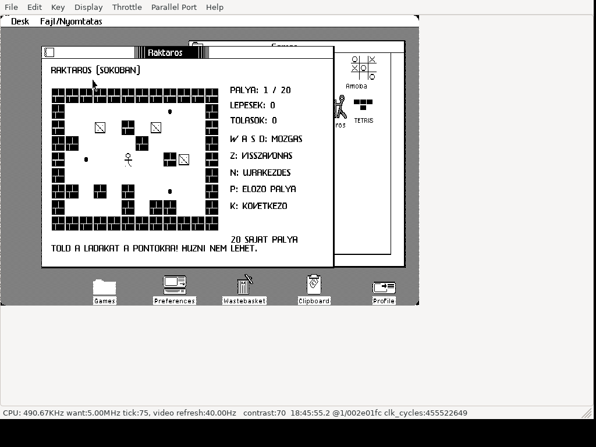

# Raktaros (Sokoban) for Apple Lisa 2

**Native game for real Apple Lisa 2 hardware running Lisa Office System 3,
including Lisa 2/5 and Lisa 2/10.** The release contains a native Motorola
68000 LOS application. LisaEm is also supported.

Hungarian Sokoban for Apple Lisa Office System 3, running in a window.
Push every crate onto a marked goal. You can push one crate at a time;
you cannot pull crates. Includes **20 original, solvable levels**.
Hungarian captions use unaccented characters for the Lisa font.

## Download and run

Download **[Raktaros.dc42](https://github.com/julyus7/lisa-raktaros/releases/latest/download/Raktaros.dc42)**
from Releases, or [dist/Raktaros.dc42](dist/Raktaros.dc42) using Download raw.
The image is a tagged 400 KB Lisa floppy in Disk Copy 4.2 format:
**419,284 bytes**. It is an application floppy; boot your own LOS installation first.

### Real Apple Lisa 2

1. Boot Lisa Office System 3 on your Apple Lisa 2.
2. Write `Raktaros.dc42` to a Lisa-format **400 KB 3.5-inch floppy** using a compatible
   disk-image writer and drive. Preserve the native Lisa sector tags in the DC42
   image when writing it. You may also use a floppy replacement that supports
   native Lisa disk images.
3. Insert the prepared floppy into the Lisa, open its disk window, select the
   game tool and choose **File/Print → Open**.
4. To install on your hard disk, use LOS **Duplicate**, then drag the duplicate
   to your Games folder. Keep the floppy inserted until copying completes;
   allow LOS to close the running tool if requested.

The DC42 download is a complete disk image: write it as a disk, rather than
copying the `.dc42` file onto a formatted floppy. Its native Lisa tags are part
of the image. For background on Lisa 2 disk media, see the
[Lisa hardware FAQ](https://lisafaq.sunder.net/lisafaq-hw-media-floppy_wheretobuy.html)
and [Lisa filesystem documentation](https://sunder.net/lisafsh/index.html).

### LisaEm

1. Boot your own Lisa Office System 3 installation in LisaEm.
2. Insert/mount `Raktaros.dc42` as the floppy disk.
3. Open the disk, select the game tool and choose **File/Print → Open**.
4. Use LOS **Duplicate** to install it on the emulated hard disk, keeping the
   floppy inserted until copying completes.

The recorded release tests were performed in LisaEm; a physical Lisa 2 test
has not yet been recorded. See [VALIDATION.md](VALIDATION.md) for the evidence.

The game has its own icon, **tool ID 242**, and volume identity ending D603.
It can coexist with Minesweeper, BlockOut, Amoba and other existing tools.
LOS allows only one copy of a given tool on a disk; replace an earlier version
of Raktaros when updating it.

## Controls

| Key | Action |
| --- | --- |
| W / A / S / D | Up / left / down / right |
| Click an adjacent cell | Move or push |
| Z | Undo; up to 2048 moves |
| N / Space | Restart the current level |
| P / K | Previous / next level; wraps between 1 and 20 |

A crate on a goal has a double frame. Movement stops when every goal is filled;
Z can undo the winning push, or K advances to the next level.

## Source and validation

- [src/M.TEXT](src/M.TEXT): released Lisa Pascal game and embedded levels.
- `src/G.TEXT`, `J.TEXT`, `D.TEXT`, `I.TEXT`: supporting LOS units.
- [BUILD.md](BUILD.md): native compiler and rebuild instructions.
- [VALIDATION.md](VALIDATION.md): native gameplay, rendering and installation checks.
- [README-HU.md](README-HU.md): magyar leiras es kezeles.
- [CREDITS.md](CREDITS.md): inherited LOS framework and source provenance.

All 20 levels passed native replay under LOS 3.1: 1176 solution moves and
60 state comparisons. Installation alongside seven existing games passed,
as did a fresh hard-disk launch with no floppy inserted.

SHA-256: `10b911d0cdabcb707fbc920edf1103cc4d0cc09a7977ca936483321113b9f165`.
